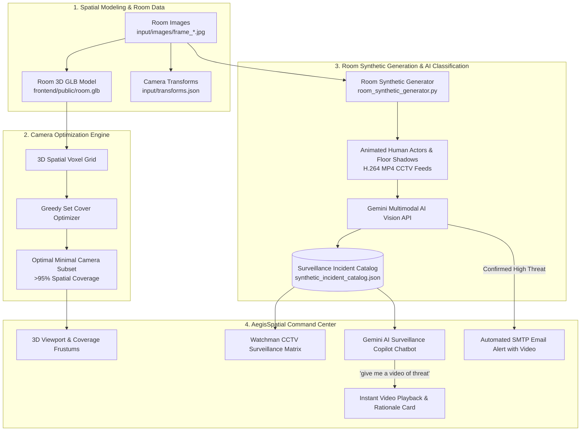

# AegisSpatial - 3D Spatial Security Optimization, Synthetic Surveillance Generation & Gemini AI Intelligence System

**AegisSpatial** is an end-to-end intelligent spatial security and surveillance optimization platform. It combines **3D Environment Modeling (GLB)**, **3D Greedy Set Cover Camera Optimization**, **Room-Conditioned Synthetic Video Generation**, **Google Gemini Multimodal AI Vision Analysis**, and an interactive **Gemini AI Surveillance Copilot Chatbot** into a unified modern command center.

---

## 🌟 Key Capabilities & Features

### 1. 🌐 3D Spatial Environment & Camera Frustum Visualizer
- **Interactive Three.js 3D Viewport**: Renders the physical room environment (`room.glb`) with full orbit controls, grid alignment, and real-time bounding volume calculation.
- **Dynamic Camera Frustum Representation**: Visualizes 3D pyramid cones, field-of-view (FOV) angles, maximum sensing ranges, and sightline coverage across the space.
- **Candidate Grid Generator**: Programmatically generates candidate ceiling-mounted sensor coordinates matching the room dimensions.

### 2. 📐 3D Greedy Set Cover Sensor Optimization
- **Voxelized Visibility Coverage**: Discretizes the 3D room into a 3D spatial voxel grid and simulates line-of-sight raycasting from candidate camera viewpoints.
- **Greedy Set Cover Solver**: Solves the NP-hard minimum camera placement problem, computing the optimal minimal subset of cameras required to achieve **>95% spatial coverage**.
- **Real-Time Coverage Metrics**: Reports camera selection breakdown, covered voxel counts, redundancy levels, and optimization compute times.

### 3. 🎬 Room-Conditioned Synthetic CCTV Video Generation
- **Direct Conditioning on Room Frames**: Synthesizes realistic surveillance video streams conditioned directly on the 101 camera POV source images in `input/images/` (`frame_0001.jpg` – `frame_0101.jpg`) used to construct `room.glb`.
- **Animated Human Actors & Kinematics**:
  - **Theft & Package Tampering**: Intruder in dark hoodie approaching unattended equipment, reaching down, concealing items, and retreating.
  - **Perimeter Boundary Breach**: Stealth intruder crouching and rapidly moving past security lasers and corridor checkpoints after hours.
  - **Suspicious Entryway Loitering**: Individual pacing nervously near secure doorways and inspecting lock mechanisms.
  - **Authorized Foot Traffic**: Facility occupants casually walking with beverages down the hallway at a steady pace.
  - **Scheduled Security Patrol**: Uniformed security officer methodically verifying doors and physical checkpoints.
  - **Monitored Clear Zone**: Secure baseline monitoring maintaining optical clarity with zero movement.
- **Realistic Kinematics & Floor Shadows**: Renders sinusoidal walking strides, perspective depth scaling, floor contact shadows matching ceiling lights, and CCTV live OSD timestamp overlays.
- **Universal Browser Playback**: Encodes clips into standard H.264 MP4 (`yuv420p` / `avc1`) using `imageio` for playback across all modern web browsers.

### 4. 👁️ Google Gemini Multimodal AI Vision Classification
- **Automated Frame-by-Frame Evaluation**: Powered by Google Gemini (`gemini-flash-lite-latest` / `gemini-3.8-flash` / `gemini-flash-latest`) using the configured `GEMINI_API_KEY`.
- **Structured JSON Metadata Extraction**:
  - `is_threat`: `true` / `false`
  - `threat_type`: `theft`, `perimeter_breach`, `loitering`, `normal_traffic`, `routine_patrol`, `clear_zone`
  - `severity`: `HIGH`, `MEDIUM`, `LOW`, `NONE`
  - `confidence`: Calibrated AI confidence score (e.g. `95%` – `98%`)
  - `rationale`: Comprehensive spatial security breakdown analyzing detected movements, attire, and zone integrity.

### 5. 🤖 Gemini AI Surveillance Copilot (Interactive Bottom Chatbot)
- **Natural Language Incident Retrieval**: Natural conversational assistant embedded directly in the command center.
- **Instant Video Retrieval & Playback**: Queries such as *"give me a video of threat"*, *"give me a video of non-threat"*, *"show me theft in the hallway"*, or *"was there any loitering?"* automatically return:
  - Concise Gemini AI situational summary.
  - Dynamic interactive video cards with threat/non-threat badges.
  - Full-screen modal player with instant playback and detailed spatial reasoning.
- **Multi-Engine Intelligence**: Seamlessly leverages Gemini Multimodal AI with fallback support for local Ollama instances (`llama3.2`) and rule-based spatial security matching.

### 6. 📺 Watchman CCTV Surveillance Matrix
- **Multi-Channel Synchronized Grid**: Live multi-camera monitoring view displaying all room-conditioned surveillance channels.
- **Source Image Attribution**: Every channel displays its exact source image tag (e.g., `Source: input/images/frame_0001.jpg`).
- **On-Demand AI Threat Scans**: One-click button to dispatch any live channel to Gemini Vision for instant verification.

### 7. 🚨 Automated SMTP Security Alert Dispatcher
- **Zero False-Alarm Notifications**: Dispatches automated email alerts via `aiosmtplib` with attached surveillance video clips **ONLY** when a high-priority threat is verified by Gemini AI.

---

## 🏛️ System Architecture & Workflow



---

## 💡 Key Advantages & Benefits

1. **Hardware Cost Reduction**: The 3D Greedy Set Cover algorithm minimizes required physical camera hardware while guaranteeing complete spatial coverage without blind spots.
2. **Elimination of Operator Fatigue**: Continuous Gemini AI vision eliminates the human error inherent in monitoring dozens of CCTV feeds simultaneously.
3. **Site-Specific Synthetic Training Data**: Generates consistent synthetic scenario variations directly conditioned on the exact physical facility images, reducing the need for expensive on-site staging.
4. **Conversational Speed-of-Thought Querying**: Security personnel can search hours of footage in seconds through simple natural language commands like *"give me a video of threat"*.

---

## 📁 Project Structure

```
Larpmaster123/
├── README.md                           # System documentation & roadmap
├── extract_and_process_colmap.py       # Frame extraction & COLMAP transform generator
│
├── input/                              # Room source assets
│   ├── images/                         # 101 POV room images (frame_0001.jpg - frame_0101.jpg)
│   ├── transforms.json                 # Camera extrinsics & intrinsics matrices
│   └── test.mp4                        # Input surveillance video capture
│
├── backend/                            # FastAPI Python Backend
│   ├── app/
│   │   ├── main.py                     # API entry point & static file mounts
│   │   ├── config.py                   # Environment settings (Gemini, SMTP)
│   │   ├── routers/                    # FastAPI route handlers
│   │   │   ├── synthetic.py            # Synthetic dataset & catalog endpoints
│   │   │   ├── ollama_router.py        # AI Assistant query endpoints
│   │   │   ├── optimization.py         # 3D Set Cover & grid optimization
│   │   │   ├── inference.py            # Multimodal feed evaluation
│   │   │   ├── alerts.py               # SMTP email alert dispatching
│   │   │   └── colmap.py               # COLMAP data ingestion
│   │   ├── services/
│   │   │   ├── room_synthetic_generator.py # Room video generator with human actors
│   │   │   ├── gemini_service.py       # Google Gemini AI vision integration
│   │   │   ├── ollama_service.py       # Copilot query matching & retrieval engine
│   │   │   ├── set_cover.py            # 3D Greedy Set Cover algorithm
│   │   │   ├── grid_generator.py       # Candidate camera placement generator
│   │   │   └── mailer.py               # Async SMTP video email dispatcher
│   │   └── schemas/                    # Pydantic data schemas
│   ├── outputs/                        # Generated H.264 video clips & catalog JSON
│   ├── requirements.txt                # Python backend dependencies
│   └── .env                            # API keys (GEMINI_API_KEY, SMTP settings)
│
└── frontend/                           # React + Vite + Tailwind CSS Frontend
    ├── public/
    │   ├── room.glb                    # 3D GLTF/GLB room environment model
    │   └── videos/                     # Browser-compatible H.264 surveillance clips
    ├── src/
    │   ├── App.jsx                     # Main application layout & state manager
    │   ├── components/
    │   │   ├── Viewport3D.jsx          # 3D Three.js room visualizer with camera frustums
    │   │   ├── CameraFeedGrid.jsx      # Watchman CCTV Surveillance Matrix
    │   │   ├── OllamaAssistantBar.jsx  # Gemini AI Surveillance Copilot Chatbot
    │   │   ├── SyntheticGeneratorPanel.jsx # Synthetic Video Studio & Room Gallery
    │   │   ├── OptimizationPanel.jsx   # 3D Set Cover parameter controls & metrics
    │   │   ├── AlertModal.jsx          # Manual/automated SMTP alert dispatcher
    │   │   ├── Header.jsx              # Command center navigation bar
    │   │   └── Sidebar.jsx             # System telemetry & quick statistics
    │   └── utils/api.js                # Axios API client
    ├── package.json
    └── vite.config.js
```

---

## 🚀 Quick Start Guide

### Prerequisites
- **Python 3.10+**
- **Node.js 18+** & `npm`
- **Google Gemini API Key** (configured in `backend/.env`)

---

### Step 1: Start the Backend Server (FastAPI)

```bash
cd backend
pip install -r requirements.txt
python -m uvicorn app.main:app --reload --port 8000
```
- Interactive OpenAPI Swagger Documentation: **[http://localhost:8000/docs](http://localhost:8000/docs)**

---

### Step 2: Start the Frontend Application (React + Vite)

```bash
cd frontend
npm install
npm run dev
```
- Open your browser at: **[http://localhost:5173](http://localhost:5173)**

---

### Step 3: (Optional) Re-Generate & Classify All Room Scenarios

To re-synthesize and re-classify all scenario feeds from the command line:

```bash
cd backend
python -m app.services.room_synthetic_generator
```

---

## 🔮 Future Improvements & Roadmap

The following architectural enhancements are planned for future development milestones:

1. **3D Digital Twin via Gaussian Splatting**:
   - The ideal long-term goal is to integrate advanced 3D radiance field / Gaussian Splatting rendering techniques to construct photorealistic, continuous 3D digital twins of physical environments with real-time novel-view synthesis and dynamic lighting interaction.

2. **Computer Vision Segmentation on Real-World Data Feeds**:
   - Integrate modern Computer Vision segmentation and tracking models (such as YOLOv11, SAM 2 / Segment Anything, and ByteTrack) to segment, track, and classify real-world camera video feeds directly in real time, augmenting and transitioning beyond synthetic data generation.

3. **3D-to-2D Spatial Coordinate Mapping Pre-Processing**:
   - Establish explicit mathematical mapping of 3D spatial voxel coordinates directly to 2D input source images prior to Structure-from-Motion (COLMAP) pre-processing, enabling bi-directional pixel-to-voxel calibration and fine-grained spatial sensor alignment.
